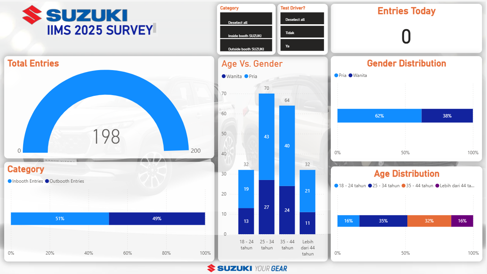

# Dashboard-for-monitoring-survey
This dashboard is designed to monitor the demographic distribution of respondents collected during the motor show survey. It provides an overview of respondent profiles—such as age, gender, location, and other relevant characteristics—to ensure balanced and representative data collection. The insights serve as a foundation for deeper analysis and support Suzuki in evaluating the reach and coverage of the survey before moving forward to further customer insights.

